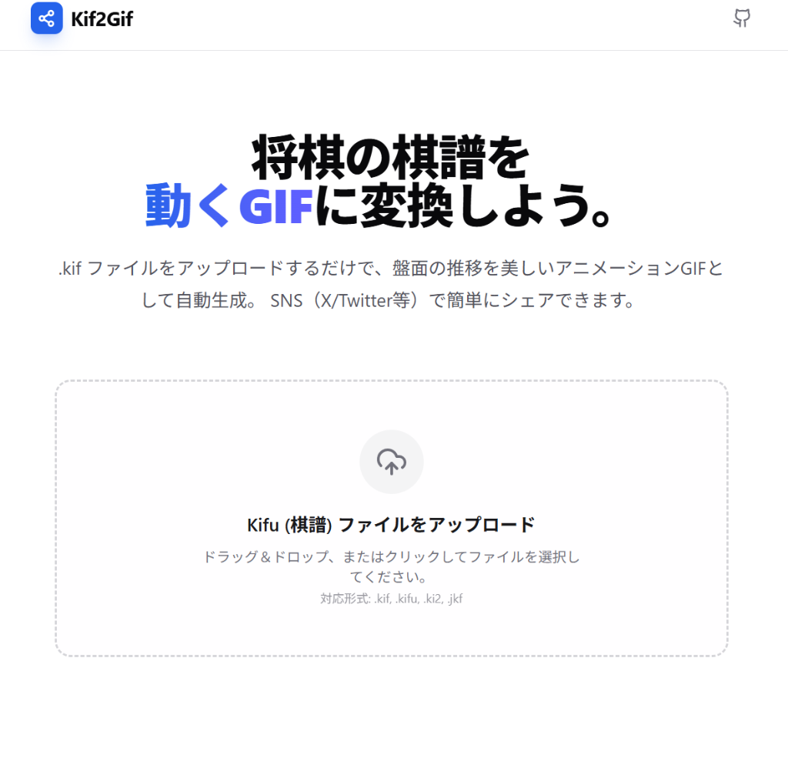
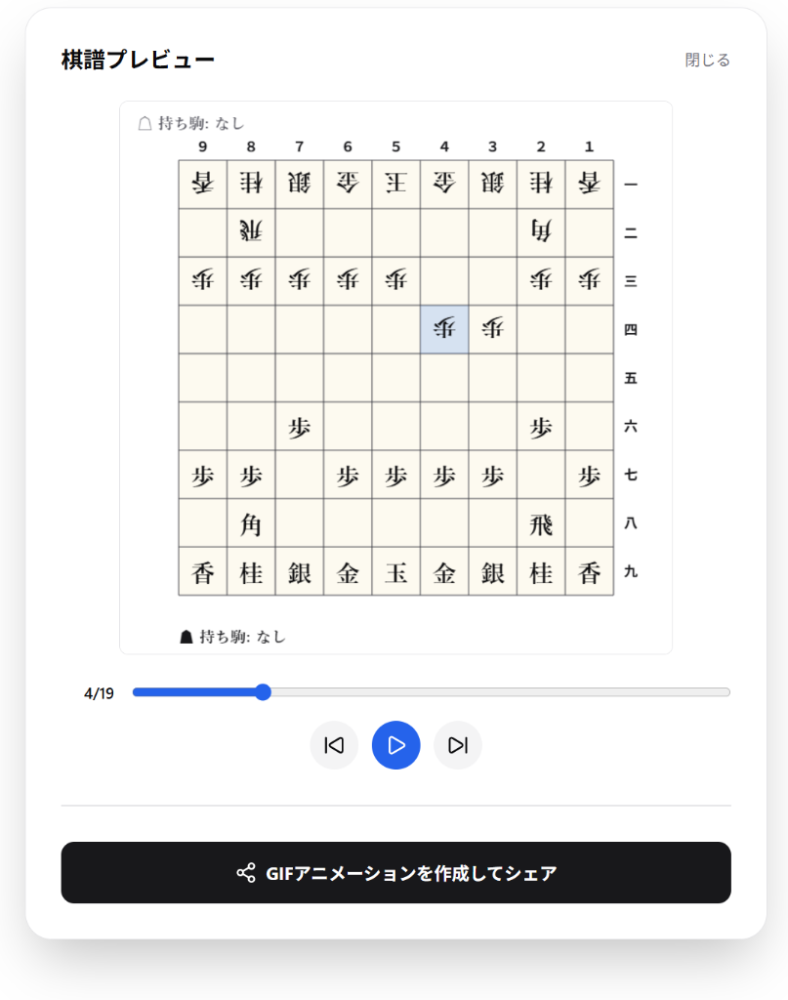
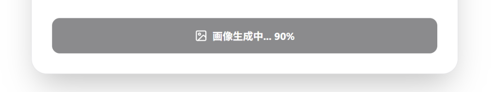
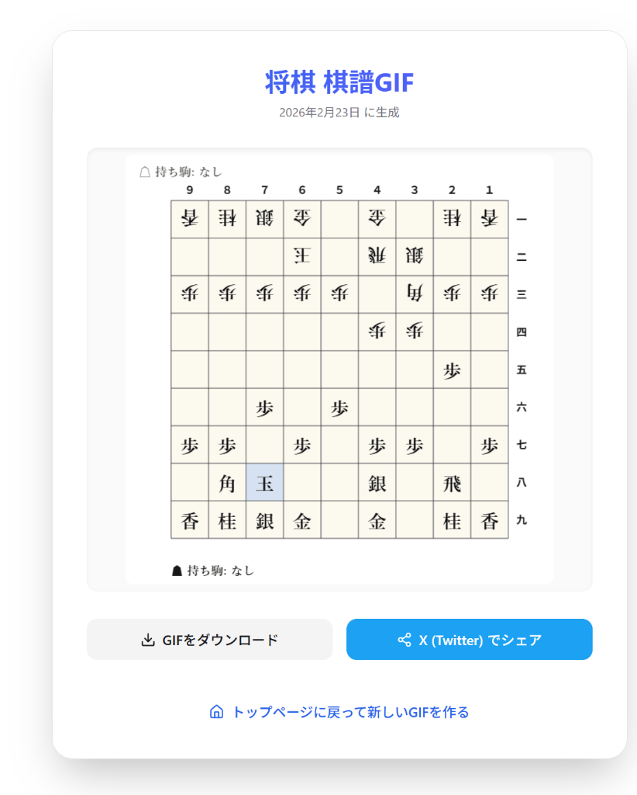
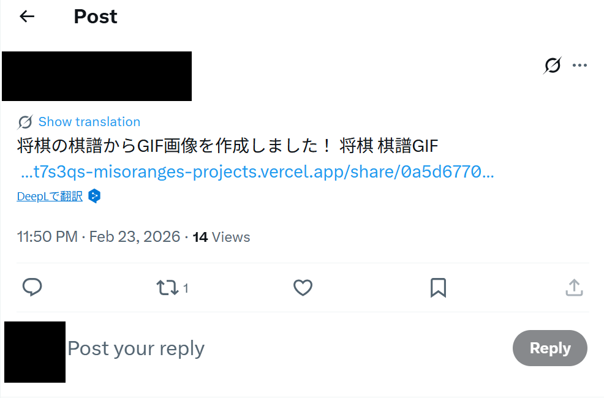

# Kif2Gif Web (将棋の棋譜からGIFを作るアプリ)

Vercel URL: https://kif2gif.vercel.app/

**開発期間**: 2026.02.21 ~ 2026.02.24 (約30時間)

## アプリの概要
将棋の対局データ（.kifファイルなど）を読み込んで、実際の盤面が動くアニメーションGIFをブラウザ上で簡単に作れるWebアプリです。
作ったGIFはそのままダウンロードしたり、X（Twitter）でシェアしたりできます。

以前作ったツールをもとに、今回はNext.jsを使ってモダンなWebアプリとして作り直してみました。

## スクリーンショット・実際の動作

1. **トップページ**
   
   シンプルなUIで、すぐに棋譜ファイルをアップロードできるようにしました。

2. **盤面プレビュー画面**
   
   読み込んだ棋譜が正しく反映されているか、再生ボタンで確認できます。

3. **GIF生成中の様子**
   
   変換中は進捗がわかるようにしています。

4. **シェア用ページ**
   
   生成したGIFが再生される専用ページです。ここからダウンロードやXへのシェアが可能です。

5. **X (Twitter) でシェアした様子**
   
   作成したGIF付きで簡単に投稿できます。

## 工夫したところ・頑張ったポイント
- **フロントエンドでのGIF生成**: サーバーに負荷をかけないよう、クライアント側（ブラウザ側）でCanvasを使って1コマずつ盤面を描画し、それを束ねてGIF化する処理を実装しました。意外と重い処理なので、少しでもサクサク動くように調整を頑張りました。
- **Supabaseの活用**: 生成したGIFをホスティングしてシェアURLを発行するために、バックエンドにはSupabase（StorageとDatabase）を使っています。
- **UI/UX**: Vercelにデプロイすることを前提に、全体的にシンプルで使いやすい、モダンなデザイン（Tailwind CSS）を意識して作りました。

## 使用技術
- **Framework**: Next.js (App Router), React
- **Styling**: Tailwind CSS
- **Backend / Storage**: Supabase
- **Deployment**: Vercel
- **Others**: json-kifu-format (棋譜のパース), gifencoder (GIF生成)

## 動かし方 (ローカル環境)
リポジトリをクローンして手元で動かす手順です。

```bash
# 依存パッケージのインストール
npm install

# 環境変数の設定
# .env.example の内容を .env.local にコピーして、Supabaseのキーなどを設定してください。

# 開発サーバーの起動
npm run dev
```
ブラウザで `http://localhost:3000` にアクセスすると表示されます。
